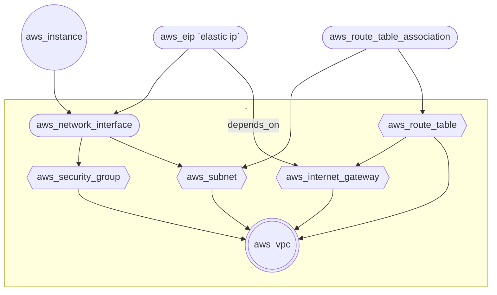

https://www.youtube.com/watch?v=SLB_c_ayRMo
NOTESS:

- Kendi hesabımızın credentiallarını aldık.
- EC2 oluşturuyoruz

  - ubuntu AMI
  - Free tier'a uygun birşey yaptık. public IP4 falan verdi (WOW)
  - Buradaki AMI denilen birşey var. Snapshot finger print gibi birşey ellam
  - parametre olarak kullanabiliyoruz, hardcoded olarak da yapabiliyoruz.
  - resource "aws_instance" (EC2 oluyor)
  - AMI region'a göre değişiyor. Aynı image farklı region'da farklı ami'lere sahip...
  - terraform init yaptık. aws ile alakalı birşeyelr yükledi. (Installing hashicorp/aws v5.11.0...)
  -

- EC2 -> Key pairs -> Create
  - pem is for mac-linux
  - ppk is for windows. But it is convertable to pem
  - let's download pem
  - install putty into you pc
  - puttygen will be installed with it. It can generate ppk from pem
  - OR you can run ssh code with. `ssh -i mykey.pem user@mydomain.example`

# Birşeyler daha yaptı abimiz

- subnet için availabilty zone vermemiz kıymetli. Ve bu zone değerleri region + 'a' | 'b' | 'c' gibi oluyor.

# Commands

- terraform state list
- terraform state show {resource_name}
  - terraform state show aws_eip.one
  - terraform state show aws_instance.web_instance

# Resources and relations

